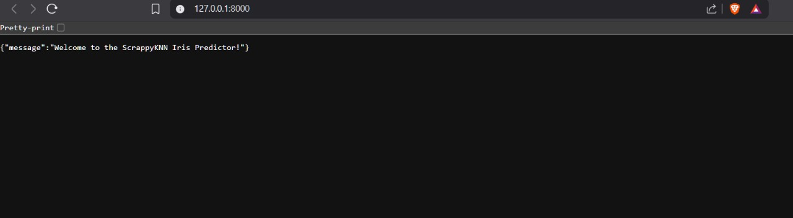
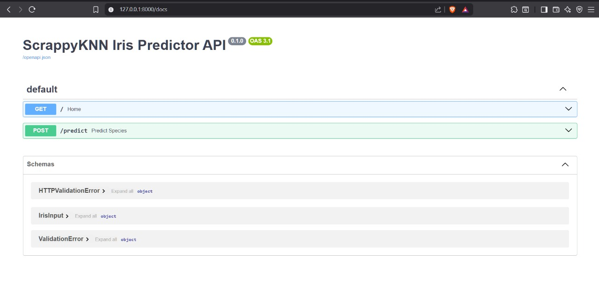
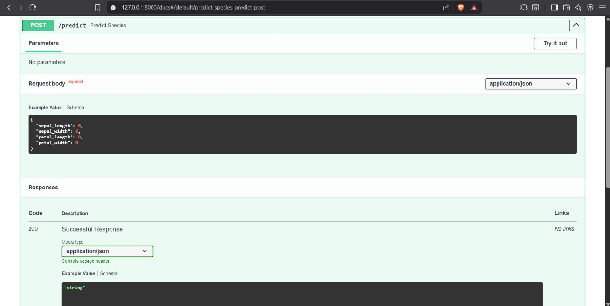
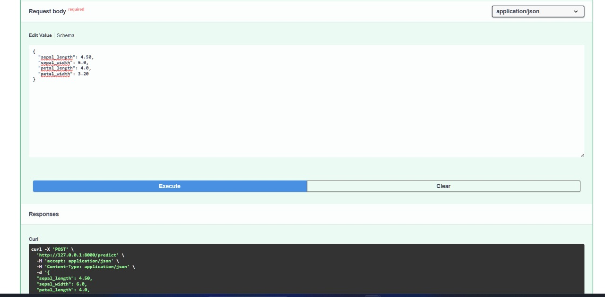
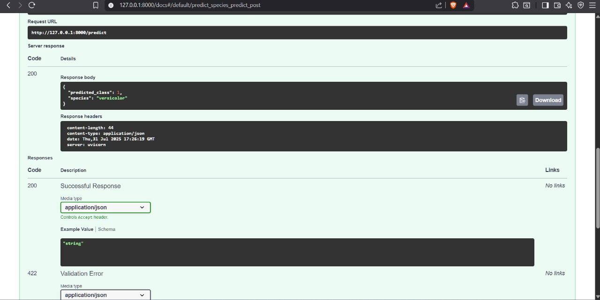

# 🌸 ScrappyKNN Iris Predictor API

A simple, custom-built **K-Nearest Neighbors (KNN)** classifier from scratch (ScrappyKNN) trained on the Iris dataset, wrapped in a FastAPI application. Ideal for showcasing **core ML understanding**, API development, and Swagger-based testing.

---

## 🚀 Features

- 🔧 **Custom KNN implementation** (no scikit-learn KNN used)
- ⚡ **FastAPI** RESTful service with Swagger UI
- 📤 JSON input and output
- 🔍 Predicts Iris flower types: **Setosa**, **Versicolor**, or **Virginica**
- ✅ Designed for internships and ML/AI demos

---

## 📊 Dataset

- **Source:** `sklearn.datasets.load_iris()`
- **Features:**
  - Sepal Length
  - Sepal Width
  - Petal Length
  - Petal Width
- **Labels:**
  - `0` = Setosa
  - `1` = Versicolor
  - `2` = Virginica

---

## 🧠 Model

The `ScrappyKNN` class includes:
- 📏 Manual Euclidean distance computation
- 🎯 `fit()` method to store training data
- 🧠 `predict()` method that finds the closest training point
- 🚫 No built-in ML libraries like scikit-learn’s KNN used

---

## 🔧 Setup Instructions

### 1️⃣ Clone the Repo

```bash
git clone https://github.com/Aryanshukla578/ScrappyKNN-FastAPI-Iris.git
cd ScrappyKNN-FastAPI-Iris
```

### 2️⃣ Create a Virtual Environment (Optional)

```bash
python -m venv venv
source venv/bin/activate   # On Windows: venv\Scripts\activate
```

### 3️⃣ Install Requirements

```bash
pip install -r requirements.txt
```

### 4️⃣ Run the Server

```bash
uvicorn main:app --reload
```

### 5️⃣ Test on Swagger UI

Open your browser and go to:
```
http://127.0.0.1:8000/docs
```

---

## 📤 Sample Request

```json
{
  "sepal_length": 5.1,
  "sepal_width": 3.5,
  "petal_length": 1.4,
  "petal_width": 0.2
}
```

### ✅ Sample Output

```json
{
  "prediction": "setosa"
}
```

---

## 📁 Project Structure

```
ScrappyKNN-FastAPI-Iris/
├── main.py                 # FastAPI app
├── ml.py                   # Custom classifier logic
├── scrappy_knn.py          # ScrappyKNN class
├── requirements.txt        # Python dependencies
├── sample_input.json       # Sample input file
├── Screenshots/            # App screenshots
└── README.md               # This file!
```

---

## 📸 Screenshots

### 🔹 Homepage Response


### 🔹 Swagger UI - Input Format


### 🔹 Prediction Output - versicolor


### 🔹 Second Input Trial


### 🔹 Final Result with Prediction


---

## 👨‍💻 Author

**Aryan Shukla**  
📧 Email: [as3061693@gmail.com](mailto:as3061693@gmail.com)  
🔗 GitHub: [@Aryanshukla578](https://github.com/Aryanshukla578)

---

## 💬 License

> This project is open for educational and demo purposes.  
> Feel free to fork, clone, or extend the idea!

---

⭐ *If you liked this project, drop a star on GitHub!*
